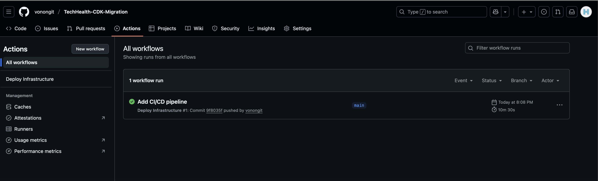

# TechHealth Infrastructure Migration

Converting a manually-deployed healthcare platform from click-ops to Infrastructure as Code using AWS CDK.

## The Challenge

TechHealth's AWS infrastructure was originally deployed through the AWS console (click-ops), making it difficult to track changes, replicate environments, or roll back updates. This project demonstrates migrating that infrastructure to code using AWS CDK.

## What I Built



Replicated and automated deployment of a full healthcare platform infrastructure:

- **EC2 Instances**: Application servers hosting the platform
- **RDS Database**: PostgreSQL/MySQL database for patient data
- **VPC & Networking**: Isolated network with public/private subnets
- **Security Groups**: Network security rules controlling access
- **IAM Roles**: Role-based access control between resources

## Technologies Used

- **AWS CDK** (Cloud Development Kit)
- **TypeScript** (CDK language)
- **AWS Services**: EC2, RDS, VPC, IAM
- **CloudFormation** (underlying deployment)
- **Git** for version control

## Key Accomplishments

✅ **Reproduced existing infrastructure** - Analyzed click-ops setup and recreated it entirely as code  
✅ **Version control** - Infrastructure changes now tracked in Git with full history  
✅ **Repeatability** - Can deploy/tear down entire environment consistently  
✅ **Documentation** - All resources defined in code serve as living documentation  

## Technical Implementation

### Infrastructure Design
- Multi-tier architecture with public and private subnets
- Security groups implementing least-privilege access
- RDS in private subnet, only accessible from application tier
- IAM roles following principle of least privilege

### Deployment Process
Implemented full IaC workflow:
```bash
cdk bootstrap  # One-time environment setup
cdk synth      # Generate CloudFormation templates
cdk diff       # Preview changes before deployment
cdk deploy     # Deploy infrastructure
```

### Challenges Solved (Explained further in Process.md)
- **S3 Versioning**: Learned to handle versioned bucket deletion during teardown
- **Resource Dependencies**: Properly ordered resource creation/deletion
- **State Management**: Managed CloudFormation stacks and CDK bootstrap resources

## Running This Project

**Prerequisites:** Node.js, AWS CLI, AWS CDK, configured AWS credentials

**Deploy:**
```bash
npm install
cdk bootstrap aws://ACCOUNT-ID/AWS-REGION
cdk deploy --all
```

**Teardown:**
```bash
cdk destroy --all
```

## What This Demonstrates

**Cloud Infrastructure Skills:**
- Designing multi-tier AWS architectures
- Implementing network security best practices
- Managing infrastructure lifecycle

**DevOps/IaC Skills:**
- Infrastructure as Code with AWS CDK
- CloudFormation stack management
- Version control for infrastructure

**Problem Solving:**
- Migrating legacy infrastructure to modern practices
- Troubleshooting deployment issues
- Understanding cloud resource dependencies

## Future Enhancements

- [ ] Add CI/CD pipeline for automated deployments
- [ ] Implement multi-environment support (dev/staging/prod)
- [ ] Add monitoring and alerting with CloudWatch
- [ ] Implement automated backups for RDS
- [ ] Implement Auto Scailing Groups (ASG) for potential traffic spikes

## Conclusion

This solution makes the infrastructure better equipped for making agile changes, introduces version control, a secure environment and a production ready solution that proves the ability to be modified and redeployed. Migrating to IaC with CDK benefits the company in many ways allowing:

- **Faster deployment cycles** through automated provisioning and consistent environments
- **Reduced human error** by eliminating manual configuration and ensuring repeatable deployments
- **Cost optimization** through infrastructure versioning that enables easy rollback and testing before production
- **Team collaboration** with infrastructure code that can be reviewed, tested, and approved like application code
- **Scalability** that supports future growth without requiring infrastructure redesign
- **Disaster recovery** capabilities through quick redeployment from version-controlled templates

This foundation positions the organization to rapidly innovate while maintaining security, compliance, and operational excellence.

---

**Travon Mayo** | [GitHub](https://github.com/travonmayo) | [LinkedIn](https://linkedin.com/in/travonmayo)# Clickops-To-CDK-IAC-Project
